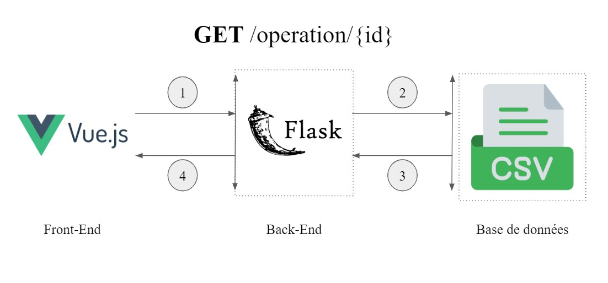
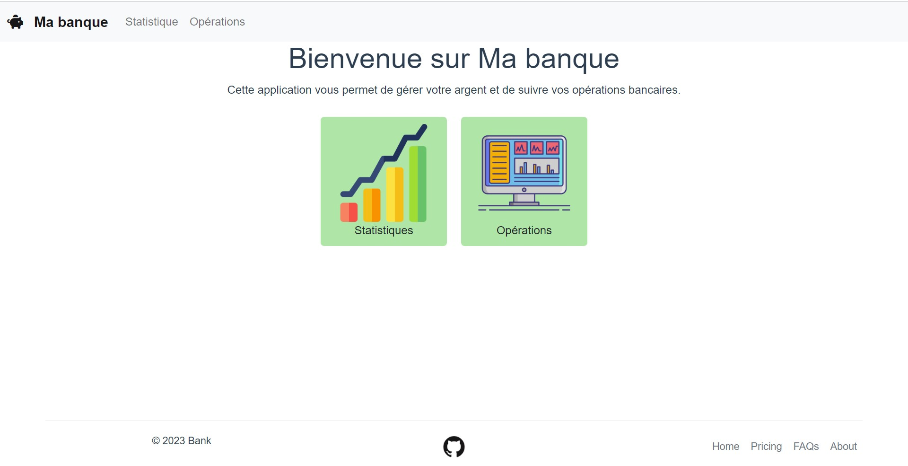

# Bank APP

Le projet Bank est une application bancaire de monitoring.  
Il permet de :  
- suivre l'évolution de son argent via différent indicateurs
- ajouter ou supprimer des opérations bancaires


## Technologie :

Le projet est développé avec trois techno :
- Frontend : VueJS
- Backend : Flask
- BDD : csv




## Comment déployer l'application :

### Backend (Python 3.8.8)

1. Installer les librairies :  

```
cd back-bank/
pip install -r requirements.txt
```

2. Lancer l'api Flask :  
```
python -m flask run
```

Running on http://127.0.0.1:5000/

### Frontend

1. Installer le framework VueJS (v5.0.8)

```
cd front-bank/
npm install vue
```

2. Installer les librairies VueJS

```
npm install
```

3. Lancer l'application

```
npm run serve
```

Local: http://localhost:8080/

